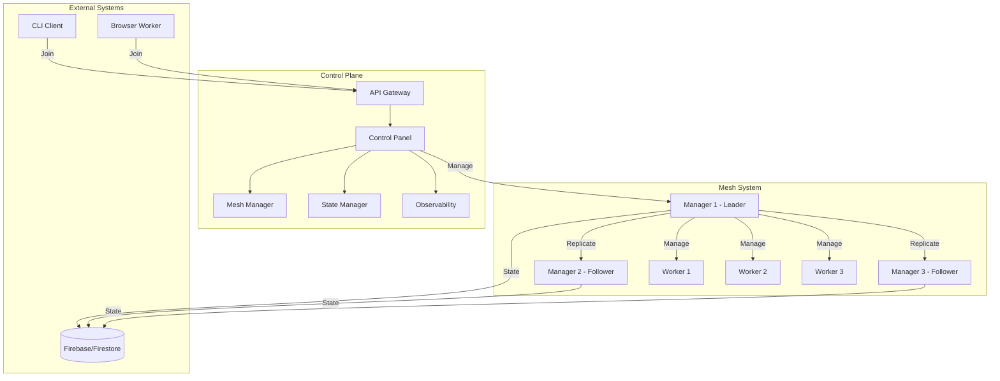
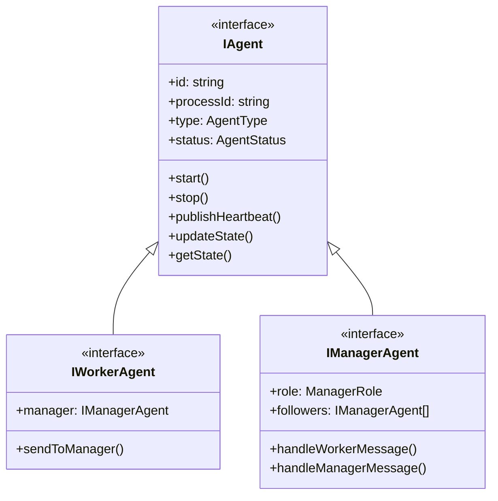
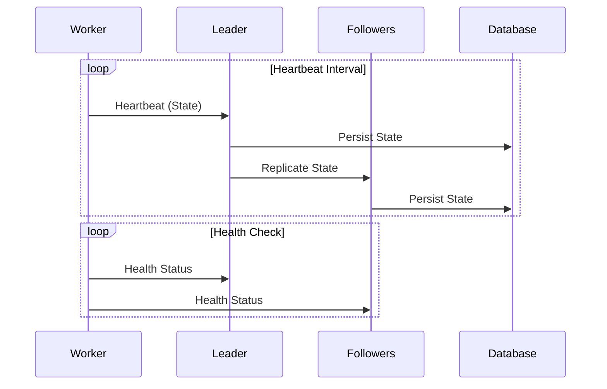
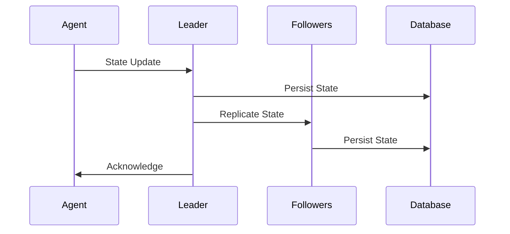
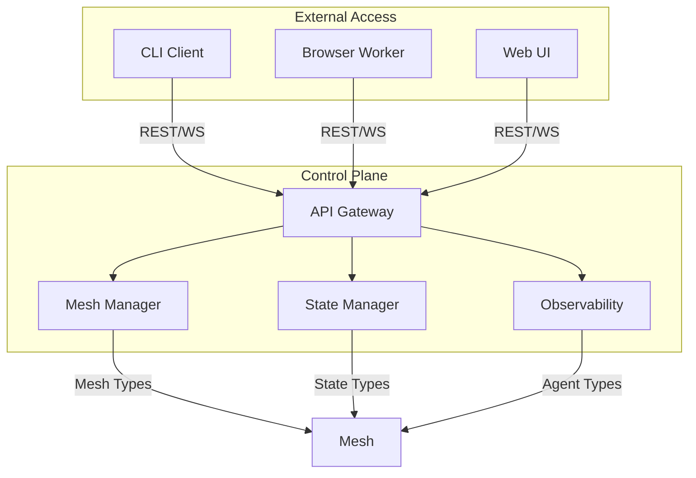
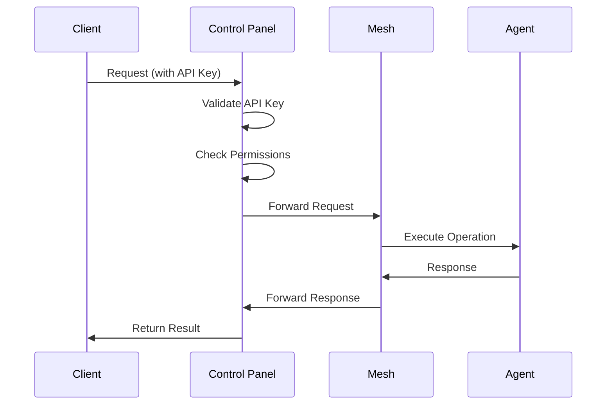
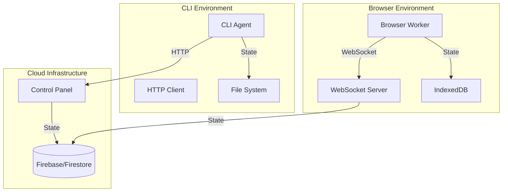

# Mesh System Technical Specification

## 0. Context and Requirements

### 0.1 Project Context

The Mesh System is being developed as part of the AI Agent SDK to support distributed, real-time applications with a focus on social deduction games like Mafia. The system enables multiple agents to interact in a coordinated manner across different execution environments while maintaining state consistency and providing robust communication channels.

### 0.2 Core Requirements

#### 0.2.1 Resilience and Reliability
- System must maintain operation during network partitions
- Automatic recovery from agent failures
- State persistence across process restarts
- Heartbeat-based health monitoring
- Leader election and failover

#### 0.2.2 Observability
- Real-time health monitoring of all agents
- Performance metrics collection
- Error tracking and reporting
- Distributed tracing capabilities
- Audit logging for security events

#### 0.2.3 Maintainability
- Clean separation of concerns
- Modular architecture
- Extensible interfaces
- Comprehensive testing
- Clear documentation

#### 0.2.4 Testability
- Unit test coverage
- Integration testing
- Chaos testing
- Performance testing
- Mock implementations

#### 0.2.5 Scalability
- Support for 12-30 agents per mesh
- Dynamic scaling capabilities
- Efficient resource utilization
- Load balancing
- State management optimization

### 0.3 Initial Use Case: Mafia Game

The system will initially support a Mafia game implementation where:
- Each player is represented by an agent
- Agents can run in different environments (browser, CLI)
- Game state is maintained across the mesh
- Players can interact through their agents
- Game mechanics are implemented as agent behaviors

### 0.4 Technical Constraints

#### 0.4.1 Initial Infrastructure
- Firebase/Firestore for state management
- WebSocket for real-time communication
- REST APIs for control operations
- Browser and CLI as initial targets

#### 0.4.2 Security Requirements
- API key authentication
- Role-based access control
- Operation-level permissions
- Secure communication channels
- Rate limiting and throttling

#### 0.4.3 Performance Requirements
- Sub-second heartbeat intervals
- Low-latency agent communication
- Efficient state synchronization
- Scalable message routing
- Resource-efficient operation

### 0.5 Integration Requirements

#### 0.5.1 Existing Packages
- Connectivity package for infrastructure abstraction
- Multi-logger for logging
- Rate limiter for request throttling
- Common utilities for shared functionality

#### 0.5.2 Future Extensions
- Support for additional deployment targets
- Enhanced monitoring capabilities
- Advanced game mechanics
- Cross-region deployment
- Mesh-to-mesh communication

### 0.6 Development Approach

#### 0.6.1 Implementation Phases
1. Core Infrastructure
   - Basic mesh implementation
   - Agent provisioning
   - State management
   - Communication channels

2. Control Panel
   - Service implementation
   - Security layer
   - Monitoring
   - API gateway

3. Agent Implementation
   - Browser agent
   - CLI agent
   - Heartbeat system
   - State persistence

4. Testing & Integration
   - Test infrastructure
   - Integration tests
   - Chaos testing
   - Performance validation

#### 0.6.2 Quality Assurance
- Comprehensive test coverage
- Performance benchmarking
- Security auditing
- Documentation
- Code review process

## 1. Overview

The Mesh System is a distributed, highly available, and scalable network of agents that can be executed across different environments (browser workers, CLI, cloud functions, etc.). The system provides robust agent management, communication, and state synchronization capabilities.

## 2. Architecture

### 2.1 Core Components

#### 2.1.1 Mesh (Core Package)
- Distributed network of agents
- Managed by a leader-follower manager system
- Supports dynamic scaling
- Maintains topology and health information
- Provides core agent management and communication

#### 2.1.2 Control Plane (Service Package)
- Separate top-level package for mesh management
- REST and WebSocket APIs for external access
- Security and access control
- Monitoring and observability
- State management and persistence
- Agent provisioning and lifecycle management

#### 2.1.3 Agents
- Two types: Worker and Manager
- Unique identity and process ID
- State persistence and recovery
- Heartbeat mechanism
- API endpoints for control and communication

### 2.2 Package Structure

```
packages/
  ├── mesh/                    # Core mesh functionality
  │   ├── packages/
  │   │   ├── types/          # Core mesh types and interfaces
  │   │   ├── common/         # Shared utilities
  │   │   ├── browser/        # Browser agent
  │   │   ├── cli/           # CLI agent
  │   │   └── tests/         # Test utilities
  │   ├── package.json
  │   └── tsconfig.json
  │
  └── control-plane/          # Control Plane service
      ├── packages/
      │   ├── types/          # Control Plane types
      │   ├── api-gateway/    # REST and WebSocket servers
      │   ├── mesh-manager/   # Mesh management
      │   ├── state-manager/  # State management
      │   ├── observability/  # Monitoring and metrics
      │   └── tests/         # Test utilities
      ├── package.json
      └── tsconfig.json
```

### 2.3 Core Components

#### 2.3.1 Mesh (Core Package)
- Distributed network of agents
- Managed by a leader-follower manager system
- Supports dynamic scaling
- Maintains topology and health information
- Provides core agent management and communication

#### 2.3.2 Control Plane (Service Package)
- Separate top-level package for mesh management
- REST and WebSocket APIs for external access
- Security and access control
- Monitoring and observability
- State management and persistence
- Agent provisioning and lifecycle management

#### 2.3.3 Agents
- Two types: Worker and Manager
- Unique identity and process ID
- State persistence and recovery
- Heartbeat mechanism
- API endpoints for control and communication

## 3. Core Interfaces

### 3.1 Mesh Management

```typescript
interface IMesh {
  id: string;
  status: MeshStatus;
  topology: MeshTopology;
  managers: IManagerAgent[];
  workers: IWorkerAgent[];
  
  addAgent(config: AgentConfig): Promise<IAgent>;
  removeAgent(agentId: string): Promise<void>;
  getAgent(agentId: string): Promise<IAgent>;
  getStatus(): Promise<MeshStatus>;
}

interface IMeshManager {
  electLeader(): Promise<void>;
  handleLeaderFailure(): Promise<void>;
  manageAgent(agent: IAgent): Promise<void>;
  updateTopology(): Promise<void>;
}
```

### 3.2 Agent Management

```typescript
interface IAgent {
  readonly id: string;
  readonly processId: string;
  readonly type: AgentType;
  readonly status: AgentStatus;
  
  start(): Promise<void>;
  stop(): Promise<void>;
  publishHeartbeat(): Promise<void>;
  updateState(state: AgentState): Promise<void>;
  getState(): Promise<AgentState>;
}

interface IWorkerAgent extends IAgent {
  readonly manager: IManagerAgent;
  sendToManager(message: AgentMessage): Promise<void>;
}

interface IManagerAgent extends IAgent {
  readonly role: ManagerRole;
  readonly followers: IManagerAgent[];
  handleWorkerMessage(message: AgentMessage): Promise<void>;
  handleManagerMessage(message: AgentMessage): Promise<void>;
}
```

### 3.3 Control Panel

```typescript
interface IControlPanel {
  start(): Promise<void>;
  stop(): Promise<void>;
  
  // Mesh Operations
  createMesh(config: MeshConfig): Promise<MeshInfo>;
  joinMesh(meshId: string, agentConfig: AgentConfig): Promise<AgentInfo>;
  getMeshStatus(meshId: string): Promise<MeshStatus>;
  
  // Agent Operations
  provisionAgent(meshId: string, config: AgentConfig): Promise<AgentInfo>;
  terminateAgent(meshId: string, agentId: string): Promise<void>;
  getAgentStatus(meshId: string, agentId: string): Promise<AgentStatus>;
  
  // Security
  authenticate(token: string): Promise<AuthResult>;
  authorize(operation: Operation, context: AuthContext): Promise<boolean>;
}
```

### 3.4 API Gateway

```typescript
interface IApiGateway {
  start(): Promise<void>;
  stop(): Promise<void>;
  
  // REST Operations
  registerRestRoute(path: string, handler: RestHandler): void;
  registerRestMiddleware(middleware: Middleware): void;
  
  // WebSocket Operations
  registerWebSocketRoute(path: string, handler: WebSocketHandler): void;
  registerWebSocketMiddleware(middleware: WebSocketMiddleware): void;
  
  // Security
  registerAuthMiddleware(middleware: AuthMiddleware): void;
  registerRateLimiter(limiter: IRateLimiter): void;
}
```

## 4. Implementation Details

### 4.1 Leader Election

- Uses Raft consensus protocol
- Only manager agents can be leaders
- Election triggered on leader failure
- Minimum 3 managers for fault tolerance

### 4.2 Heartbeat System

- Hybrid approach:
  - Workers → Leader → Followers (state updates)
  - Workers → All Managers (health checks)
- Configurable heartbeat interval
- Failure detection and recovery
- State synchronization

### 4.3 State Management

- Per-agent state persistence
- Versioned state objects
- Incremental updates
- Conflict resolution
- State recovery on reconnection

### 4.4 Security

- API key authentication
- Role-based access control
- Operation-level permissions
- Secure communication channels
- Rate limiting and throttling

### 4.5 Monitoring

- Health metrics collection
- Performance monitoring
- Error tracking
- Distributed tracing
- Alerting system

## 5. Deployment

### 5.1 Initial Targets

1. Browser Worker
   - WebSocket communication
   - State persistence in IndexedDB
   - Heartbeat via WebSocket

2. CLI
   - REST API communication
   - State persistence in filesystem
   - Heartbeat via HTTP

### 5.2 Future Targets

1. Firebase Functions
2. AWS Lambda
3. Native Applications

## 6. Testing Strategy

### 6.1 Test Types

1. Unit Tests
   - Individual component testing
   - Mock dependencies
   - State management

2. Integration Tests
   - Component interaction
   - API endpoints
   - State synchronization

3. Chaos Tests
   - Network partitions
   - Leader failures
   - Agent crashes
   - State recovery

### 6.2 Test Infrastructure

- Jest for testing
- Mock implementations
- Test fixtures
- Chaos testing framework

## 7. Performance Considerations

### 7.1 Scalability

- Horizontal scaling of agents
- Dynamic manager addition
- Load balancing
- Resource monitoring

### 7.2 Reliability

- Fault tolerance
- Automatic recovery
- State persistence
- Network resilience

### 7.3 Monitoring

- Health metrics
- Performance metrics
- Error tracking
- Resource usage

## 8. Security Considerations

### 8.1 Authentication

- API key management
- Token validation
- Session management
- Secure storage

### 8.2 Authorization

- Role-based access
- Operation permissions
- Resource access control
- Audit logging

### 8.3 Communication

- Encrypted channels
- Message validation
- Rate limiting
- DDoS protection

## 9. Future Enhancements

1. Cross-region deployment
2. Mesh-to-mesh communication
3. Advanced game mechanics
4. Enhanced monitoring
5. Custom agent types

## 10. Implementation Timeline

### Phase 1: Core Infrastructure (2-3 weeks)
- Package structure
- Basic types and interfaces
- API gateway
- Agent factory

### Phase 2: Control Panel (2-3 weeks)
- Service implementation
- Mesh management
- Security layer
- Monitoring

### Phase 3: Agent Implementation (3-4 weeks)
- Browser agent
- CLI agent
- Heartbeat system
- State management

### Phase 4: Testing & Integration (2-3 weeks)
- Test infrastructure
- Integration tests
- Chaos testing
- Performance testing

## 11. Dependencies

### 11.1 External
- Firebase/Firestore (initial)
- Express.js
- WebSocket
- Raft implementation

### 11.2 Internal
- Connectivity package
- Multi-logger
- Rate limiter
- Common utilities

## 0.7 Architecture Diagrams

### 0.7.1 High-Level System Architecture



### 0.7.2 Agent Types and Relationships



### 0.7.3 Heartbeat System Flow



### 0.7.4 State Management Flow



### 0.7.5 Control Plane Architecture



### 0.7.6 Security Flow



### 0.7.7 Deployment Architecture

